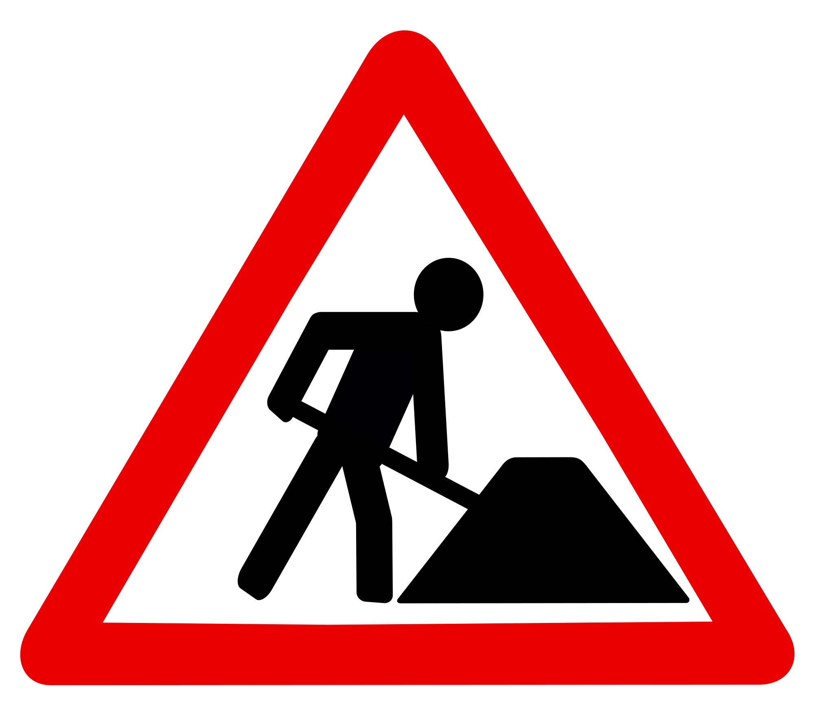

#  Under construction
Please note that current project is in active development and everything here is a subject to change.
Currently migrating code from other sources.



# Prerequisites
You will need this packages to be installed:
- ipython
- notebook
- pytorch
- torchvision

If you have conda installed on your machine, you can install these via
```
conda install ipython pytorch notebook torchvision cpuonly -c pytorch-nightly
```

# Build 
Run 
```
python setup.py develop
```
